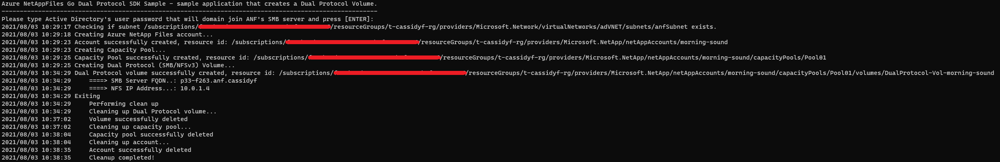

# Azure NetApp Files Dual Protocol SDK Sample for Go

This project demonstrates how to create a dual protocol Volume (SMB+NFSv3) volumes using Microsoft.NetApp resource provider from Azure Go SDK. 

In this sample application we perform the following operations:

* Creation
  * NetApp account
  * Capacity pool
  * Dual-protocol (SMB and NFSv3) volume
* Deletions (when cleanup variable is set to true)
  * Volume
  * Capacity pool
  * NetApp Account

If you don't already have a Microsoft Azure subscription, you can get a FREE trial account [here](http://go.microsoft.com/fwlink/?LinkId=330212).

## Prerequisites

1. Go installed \(if not installed yet, follow the [official instructions](https://golang.org/dl/)\).
2. Make sure you comply with the [dual-protocol considerations](https://docs.microsoft.com/en-us/azure/azure-netapp-files/create-volumes-dual-protocol#considerations) before you proceed.
3. Azure Subscription.
4. Subscription needs to have Azure NetApp Files resource provider registered. For more information, see [Register for NetApp Resource Provider](https://docs.microsoft.com/en-us/azure/azure-netapp-files/azure-netapp-files-register).
5. Resource Group created.
6. Virtual Network with a delegated subnet to Microsoft.Netapp/volumes resource. For more information, see [Guidelines for Azure NetApp Files network planning].(https://docs.microsoft.com/en-us/azure/azure-netapp-files/azure-netapp-files-network-topologies)
7. Active Directory infrastructure setup with one or more DNS servers from the AD domain (usually the Domain Controllers) available in the **same virtual network** where you're setting up Azure NetApp Files. If you want to setup an Active Directory test environment, please refer to [Create a new Windows VM and create a new AD Forest, Domain and DC](https://github.com/Azure/azure-quickstart-templates/tree/master/application-workloads/active-directory/active-directory-new-domain) for a quick setup, then you can create the subnet delegated to Microsoft.Netapp/volumes in the vnet that is created.
8. Adjust variable contents within the `var()` block at `example.go` file to match your environment
9. For this sample Go console application to work, authenticate is required.  The chosen method for this sample is service principals: 
    * Within an [Azure Cloud Shell](https://docs.microsoft.com/en-us/azure/cloud-shell/quickstart) session, make sure you're logged in from the subscription where you want to be associated with the service principal by default: 

      ```bash
      az account show
      ```

      If this is not the correct subscription, use: 

      ```bash
      az account set -s <subscription name or id>  
      ```

    * Create a service principal using Azure CLI: 

      ```bash
      az ad sp create-for-rbac --sdk-auth
      ```

      >Note: this command will automatically assign RBAC contributor role to the service principal at subscription level. You can narrow down the scope to the specific resource group where your tests will create the resources.

    * Copy the output content, paste it in a file called azureauth.json, and secure it with file system permissions. (Make sure it is not inside of any repo).  
    * Set an environment variable pointing to the file path you just created. The following example uses Powershell and bash:

      Powershell

      ```powershell
      [Environment]::SetEnvironmentVariable("AZURE_AUTH_LOCATION", "C:\sdksample\azureauth.json", "User")
      ```

      Bash

      ```bash
      export AZURE_AUTH_LOCATION=/sdksamples/azureauth.json
      ```

    >Note: for other Azure Active Directory authentication methods for Go, see [Authentication methods in the Azure SDK for Go](https://docs.microsoft.com/en-us/azure/go/azure-sdk-go-authorization).

## What does example.go do

This sample project demonstrates how to create a dual-protocol enabled volume (SMB and NFSv3). The authentication method is based on a service principal.  This project creates one NetApp account with an Active Directory object, one capacity pool, and a single dual-protocol (SMB and NFSv3) volume using the Standard service level. When executing this application, the user will be prompted to provide the password for the Active Directory User that has the permissions to domain join computers in AD.

In addition, we use some non-sensitive information from the *file-based authentication* file where we get the subscription ID initially. This information is used for the test we perform to check if the subnet provided exists before creating any Azure NetApp Files resources, failing execution if they're missing.

Authentication is made on each operation where we obtain an authorizer to pass to each client we instantiate. (In Azure Go SDK for Azure NetApp Files, each resource has its own client). For more information about the authentication process used, see the [Use file-based authentication](https://docs.microsoft.com/en-us/azure/go/azure-sdk-go-authorization#use-file-based-authentication) section of [Authentication methods in the Azure SDK for Go](https://docs.microsoft.com/en-us/azure/go/azure-sdk-go-authorization).

Lastly, the clean-up process takes place. (This process is not enabled by default; you need to change the variable `shouldCleanUp` to `true` at `example.go` file `var()` section to enable it).  It deletes all resources in the reverse order following the hierarchy; otherwise, resources that have nested resources cannot be removed. If there is an error during the application execution, the clean-up process might not take place, and you need to manually perform this task.
The clean-up process uses a function called `WaitForNoANFResource`, while other parts of the code uses `WaitForANFResource`. Currently, this behavior is required as a workaround for the current ARM behavior of reporting that the object was deleted when in fact its deletion is still in progress.  (Similarly, ARM states that volume is fully created, while this is still completing.)  Also, we will see functions called `GetANF<resource type>`. These functions were created in this sample to be able to get the name of the resource without its hierarchy represented in the `<resource type>.name` property, which cannot be used directly in other methods of Azure NetApp Files client like `get`.

>Note: See [Resource limits for Azure NetApp Files](https://docs.microsoft.com/en-us/azure/azure-netapp-files/azure-netapp-files-resource-limits) for Azure NetApp Files limits.

## Contents

| File/folder                 | Description                                                                                                      |
|-----------------------------|------------------------------------------------------------------------------------------------------------------|
| `.github\CODE_OF_CONDUCT.md`        | Microsoft's Open Source Code of Conduct.                                                                         |
| `.github\ISSUE_TEMPLATE.md`        | GitHub's issue report that describes necessary info while opening a new issue                                                                         |
| `.github\PULL_REQUEST_TEMPLATE.md`        | GitHub's pull request template.                                                                         |
| `media\`                       | Folder that contains screenshots.                                                                                              |
| `netappfiles-go-dual-protocol-sdk-sample\`                       | Sample source code folder.                                                                                              |
| `netappfiles-go-dual-protocol-sdk-sample\example.go`            | Sample main file.                                                                                                |
| `netappfiles-go-dual-protocol-sdk-sample\go.mod`            |The go.mod file defines the module’s module path, which is also the import path used for the root directory, and its dependency requirements, which are the other modules needed for a successful build.|
| `netappfiles-go-dual-protocol-sdk-sample\go.sum`            | The go.sum file contains hashes for each of the modules and it's versions used in this sample|
| `netappfiles-go-dual-protocol-sdk-sample\internal\`       | Folder that contains all internal packages dedicated to this sample.                |
| `netappfiles-go-dual-protocol-sdk-sample\internal\iam\iam.go` | Package that allows us to get the `authorizer` object from Azure Active Directory by using the `NewAuthorizerFromFile` function. |
| `netappfiles-go-dual-protocol-sdk-sample\internal\models\models.go`       | Provides models for this sample, e.g. `AzureAuthInfo` models the authorization file.                   |
| `netappfiles-go-dual-protocol-sdk-sample\internal\sdkutils\sdkutils.go`       | Contains all functions that directly uses the SDK and some helper functions.                   |
| `netappfiles-go-dual-protocol-sdk-sample\internal\uri\uri.go`       | Provides various functions to parse resource IDs and get information or perform validations.                   |
| `netappfiles-go-dual-protocol-sdk-sample\internal\utils\utils.go`       | Provides generic functions.                   |
| `.gitignore`                | Define what to ignore at commit time.                                                                            |
| `CHANGELOG.md`              | List of changes to the sample.                                                                                   |
| `CONTRIBUTING.md`           | Guidelines for contributing to the sample.                                                                       |
| `README.md`                 | This README file.                                                                                                |
| `LICENSE`                   | The license for the sample.                                                                                      |

## How to run

1. Go to your GOPATH folder and create the following path: 
    ```powershell
    # PowerShell example
    cd $env:GOPATH/src
    mkdir ./github.com/Azure-Samples
    ```

    ```bash
    # Bash example
    cd $GOPATH/src
    mkdir -p ./github.com/Azure-Samples
    ```
2. Clone the sample locally: 
    ```bash
    cd github.com/Azure-Samples
    git clone https://github.com/Azure-Samples/netappfiles-go-dual-protocol-sdk-sample.git
    ```
3. Change folder to **netappfiles-go-dual-protocol-sdk-sample/netappfiles-go-dual-protocol-sdk-sample**: 
    ```bash
    cd netappfiles-go-dual-protocol-sdk-sample/netappfiles-go-dual-protocol-sdk-sample
    ```
4. Make sure you have the `azureauth.json` and its environment variable with the path to it defined (as previously described at [prerequisites](#Prerequisites)). 
6. Edit the **example.go** `var()` file lock and change the variables contents as appropriate (names are self-explanatory).
7. Run the sample: 
    ```bash
    go run .
    ```

Sample output


## References

* [Create a dual-protocol (NFSv3 and SMB) volume for Azure NetApp Files](https://docs.microsoft.com/en-us/azure/azure-netapp-files/create-volumes-dual-protocol)
* [Troubleshoot dual-protocol volumes](https://docs.microsoft.com/en-us/azure/azure-netapp-files/troubleshoot-dual-protocol-volumes)
* [Authentication methods in the Azure SDK for Go](https://docs.microsoft.com/en-us/azure/go/azure-sdk-go-authorization)
* [Azure SDK for Go Samples](https://github.com/Azure-Samples/azure-sdk-for-go-samples) - contains other resource types samples
* [Resource limits for Azure NetApp Files](https://docs.microsoft.com/en-us/azure/azure-netapp-files/azure-netapp-files-resource-limits)
* [Azure Cloud Shell](https://docs.microsoft.com/en-us/azure/cloud-shell/quickstart)
* [Azure NetApp Files documentation](https://docs.microsoft.com/en-us/azure/azure-netapp-files/)
* [Azure SDK for Go](https://github.com/Azure/azure-sdk-for-go)
